# Historias de Usuario — Rin'ne
## Con Criterios de Aceptación y Story Map

> **Proyecto:** Rin'ne — Plataforma de streaming de música personal  
> **Versión:** 1.0  

---

## Story Map Visual e Interactivo (Mapa de Ruta)

```mermaid
flowchart TB
    subgraph Epic1["ÉPICA 1: Autenticación"]
        Act1["Actividad: Gestión de Cuenta"] --> Must1["MUST (Backbone)<br>• HU-001: Crear Cuenta<br>• HU-002: Iniciar Sesión<br>• HU-003: Cerrar Sesión"]
        Must1 --> Should1["SHOULD (Walking Skeleton)<br>• CA-002-03: Recordar Sesión<br>• CA-002-04: Redirección Protegida"]
        Should1 --> Could1["COULD (Enriquecimiento)<br>• HU-015: Recuperar Contraseña"]
    end
    subgraph Epic2["ÉPICA 2: Biblioteca"]
        Act2["Actividad: Gestión Canciones"] --> Must2["MUST (Backbone)<br>• HU-004: Subir Canción<br>• HU-005: Ver Biblioteca<br>• HU-006: Eliminar Canción"]
        Must2 --> Should2["SHOULD (Walking Skeleton)<br>• CA-004-01: Extraer Metadatos<br>• HU-007: Buscar Canción"]
        Should2 --> Could2["COULD (Enriquecimiento)<br>• Ordenar y Filtrar Lista"]
    end
    subgraph Epic3["ÉPICA 3: Reproductor"]
        Act3["Actividad: Control Playback"] --> Must3["MUST (Backbone)<br>• HU-008: Reproducir Audio<br>• CA-008-02: Pausar/Resumir<br>• HU-009: Control Volumen"]
        Must3 --> Should3["SHOULD (Walking Skeleton)<br>• HU-010: Cola de Música<br>• CA-010-02: Siguiente/Anterior"]
        Should3 --> Could3["COULD (Enriquecimiento)<br>• HU-011: Barra Progreso (Scrubbing)<br>• Modo Aleatorio y Repetir"]
    end
    subgraph Epic4["ÉPICA 4: Personalización"]
        Act4["Actividad: Apariencia HUD"] --> Must4["MUST (Backbone)<br>• HU-012: Cambiar Color HUD<br>• HU-013: Cambiar Fondo"]
        Must4 --> Should4["SHOULD (Walking Skeleton)<br>• CA-012-02: Persistir Configuración en DB"]
        Should4 --> Could4["COULD (Enriquecimiento)<br>• Configurar Partículas<br>• HU-014: Temas Visuales Predefinidos"]
    end
```

---

## Plan de Lanzamientos (Release Plan)

| Sprint / Release | Nivel de Entrega | Historias de Usuario Incluidas | Criterio de Valor / Objetivo del Release |
|---|---|---|---|
| **Sprint 1** | **Walking Skeleton (Pre-alfa)** | HU-001, HU-002, HU-003, HU-015 | **Autenticación e Identidad:** Proporcionar un portal de registro y acceso seguro cifrado con persistencia de tokens para segregar las bibliotecas de música de forma aislada. |
| **Sprint 2** | **Core Product (Alfa)** | HU-004, HU-005, HU-006, HU-008, HU-009 | **Biblioteca Básica y Playback:** Permitir la subida física de canciones, lectura automática de metadatos multimedia y reproducción interactiva estable mediante streaming de rangos. |
| **Sprint 3** | **Enriched Product (Beta)** | HU-007, HU-010, HU-011, HU-012, HU-013, HU-014 | **Interactividad y HUD Estético:** Proporcionar filtros de búsqueda rápidos, control dinámico de la cola, y habilitar la personalización visual en tiempo de ejecución del HUD y los fondos del reproductor. |

---

## ÉPICA 1: Registro y Autenticación

---

### HU-001 — Registro de usuario

**Como** visitante de Rin'ne,  
**quiero** crear una cuenta con mi email y contraseña,  
**para** acceder a mi propia biblioteca de música personal.

**Prioridad:** Must Have | **Estimación:** 5 puntos | **Sprint:** 1

#### Criterios de Aceptación

**CA-001-01:** Registro exitoso
- **Dado que** soy un visitante en la página de registro,
- **cuando** ingreso un email válido, una contraseña de al menos 8 caracteres y confirmo la contraseña,
- **entonces** el sistema crea mi cuenta, me redirige al dashboard

**CA-001-02:** Email duplicado
- **Dado que** intento registrarme con un email ya existente en el sistema,
- **cuando** envío el formulario,
- **entonces** el sistema muestra el mensaje "Este email ya está registrado" sin crear la cuenta.

**CA-001-03:** Validación de contraseña
- **Dado que** ingreso una contraseña de menos de 8 caracteres o que no coincide con la confirmación,
- **cuando** intento enviar el formulario,
- **entonces** el sistema muestra el error correspondiente y no envía la petición al servidor.

**CA-001-04:** Email con formato inválido
- **Dado que** ingreso un texto sin formato de email (sin @, sin dominio),
- **cuando** intento enviar el formulario,
- **entonces** el sistema muestra "Email no válido" y bloquea el envío.

---

### HU-002 — Inicio de sesión

**Como** usuario registrado de Rin'ne,  
**quiero** iniciar sesión con mi email y contraseña,  
**para** acceder a mi biblioteca y configuración personal.

**Prioridad:** Must Have | **Estimación:** 3 puntos | **Sprint:** 1

#### Criterios de Aceptación

**CA-002-01:** Login exitoso
- **Dado que** tengo una cuenta registrada,
- **cuando** ingreso mi email y contraseña correctos,
- **entonces** el sistema me autentica, almacena el JWT y me redirige al dashboard con mi biblioteca.

**CA-002-02:** Credenciales incorrectas
- **Dado que** ingreso un email o contraseña incorrectos,
- **cuando** envío el formulario,
- **entonces** el sistema muestra "Email o contraseña incorrectos" sin especificar cuál falló (seguridad).

**CA-002-03:** Sesión persistente
- **Dado que** inicié sesión y cierro el navegador,
- **cuando** vuelvo a abrir la app antes de que expire el token (24h),
- **entonces** el sistema me mantiene autenticado sin pedir credenciales nuevamente.

**CA-002-04:** Redirección protegida
- **Dado que** intento acceder a `/dashboard` sin estar autenticado,
- **cuando** el sistema detecta que no hay token válido,
- **entonces** me redirige a la página de login.

---

### HU-003 — Cierre de sesión

**Como** usuario autenticado,  
**quiero** cerrar mi sesión,  
**para** proteger mi cuenta en dispositivos compartidos.

**Prioridad:** Must Have | **Estimación:** 1 punto | **Sprint:** 1

#### Criterios de Aceptación

**CA-003-01:** Logout exitoso
- **Dado que** estoy autenticado,
- **cuando** hago clic en "Cerrar sesión",
- **entonces** el sistema invalida el token, limpia el estado de la app y me redirige al login.

**CA-003-02:** Acceso post-logout
- **Dado que** cerré sesión,
- **cuando** intento acceder a cualquier ruta protegida,
- **entonces** el sistema me redirige al login y no muestra datos de la sesión anterior.

---

## ÉPICA 2: Gestión de Biblioteca Musical

---

### HU-004 — Subida de canciones

**Como** usuario autenticado,  
**quiero** subir archivos de audio desde mi dispositivo,  
**para** tener mi música disponible en Rin'ne desde cualquier lugar.

**Prioridad:** Must Have | **Estimación:** 8 puntos | **Sprint:** 2

#### Criterios de Aceptación

**CA-004-01:** Subida exitosa
- **Dado que** selecciono un archivo MP3, FLAC, OGG o WAV,
- **cuando** inicio la subida,
- **entonces** el sistema muestra una barra de progreso, sube el archivo a S3, extrae los metadatos (título, artista, duración) y agrega la canción a mi biblioteca.

**CA-004-02:** Formato no soportado
- **Dado que** selecciono un archivo con extensión no soportada (ej: .exe, .pdf),
- **cuando** intento iniciar la subida,
- **entonces** el sistema muestra "Formato no compatible. Usa MP3, FLAC, OGG o WAV" y no inicia la subida.

**CA-004-03:** Sin límite de canciones
- **Dado que** ya tengo 100 canciones en mi biblioteca,
- **cuando** subo una canción adicional,
- **entonces** el sistema la acepta sin mostrar advertencia de límite.

**CA-004-04:** Subida múltiple
- **Dado que** selecciono varios archivos de audio simultáneamente,
- **cuando** inicio la subida,
- **entonces** el sistema sube todos los archivos mostrando el progreso individual de cada uno.

**CA-004-05:** Error de red durante subida
- **Dado que** se interrumpe la conexión durante una subida,
- **cuando** se detecta el error,
- **entonces** el sistema muestra "Error al subir. Intenta nuevamente" y la canción no queda registrada a medias.

---

### HU-005 — Visualización de biblioteca

**Como** usuario autenticado,  
**quiero** ver todas mis canciones subidas en una lista ordenada,  
**para** encontrar fácilmente la música que quiero escuchar.

**Prioridad:** Must Have | **Estimación:** 3 puntos | **Sprint:** 2

#### Criterios de Aceptación

**CA-005-01:** Lista de canciones
- **Dado que** tengo canciones en mi biblioteca,
- **cuando** accedo al dashboard,
- **entonces** el sistema muestra todas mis canciones con título, artista, duración y portada (si existe).

**CA-005-02:** Biblioteca vacía
- **Dado que** no he subido ninguna canción,
- **cuando** accedo al dashboard,
- **entonces** el sistema muestra el mensaje "Tu biblioteca está vacía. ¡Sube tu primera canción!" con un botón de acción.

**CA-005-03:** Carga eficiente
- **Dado que** tengo más de 50 canciones,
- **cuando** abro la biblioteca,
- **entonces** el sistema carga las primeras 20 canciones y carga más al hacer scroll (paginación lazy).

---

### HU-006 — Eliminación de canciones

**Como** usuario autenticado,  
**quiero** eliminar canciones de mi biblioteca,  
**para** mantener mi colección organizada y liberar espacio.

**Prioridad:** Must Have | **Estimación:** 3 puntos | **Sprint:** 2

#### Criterios de Aceptación

**CA-006-01:** Eliminación con confirmación
- **Dado que** tengo una canción en mi biblioteca,
- **cuando** hago clic en "Eliminar" sobre esa canción,
- **entonces** el sistema muestra un diálogo de confirmación "¿Eliminar [título]? Esta acción no se puede deshacer".

**CA-006-02:** Eliminación exitosa
- **Dado que** confirmo la eliminación de una canción,
- **cuando** acepto el diálogo,
- **entonces** el sistema elimina el archivo de S3, borra los metadatos de la base de datos y remueve la canción de la lista inmediatamente.

**CA-006-03:** Eliminación durante reproducción
- **Dado que** elimino la canción que está sonando actualmente,
- **cuando** se confirma la eliminación,
- **entonces** el reproductor se detiene y pasa a la siguiente canción en la cola (o se detiene si no hay más).

---

### HU-007 — Búsqueda de canciones

**Como** usuario autenticado,  
**quiero** buscar canciones por título o artista,  
**para** encontrar rápidamente una canción específica en mi biblioteca.

**Prioridad:** Should Have | **Estimación:** 3 puntos | **Sprint:** 3

#### Criterios de Aceptación

**CA-007-01:** Búsqueda en tiempo real
- **Dado que** escribo en la barra de búsqueda,
- **cuando** ingreso al menos 2 caracteres,
- **entonces** la biblioteca se filtra en tiempo real mostrando solo canciones que coincidan en título o artista.

**CA-007-02:** Sin resultados
- **Dado que** busco un término sin coincidencias,
- **cuando** el sistema filtra la biblioteca,
- **entonces** muestra "No se encontraron canciones para '[término]'".

**CA-007-03:** Limpiar búsqueda
- **Dado que** tengo un término de búsqueda activo,
- **cuando** borro el texto o hago clic en la X de la barra,
- **entonces** la biblioteca vuelve a mostrar todas las canciones.

---

## ÉPICA 3: Reproductor de Música

---

### HU-008 — Reproducción de canciones

**Como** usuario autenticado,  
**quiero** reproducir canciones de mi biblioteca,  
**para** escuchar mi música directamente en el navegador.

**Prioridad:** Must Have | **Estimación:** 8 puntos | **Sprint:** 2

#### Criterios de Aceptación

**CA-008-01:** Iniciar reproducción
- **Dado que** hago doble clic o clic en el botón "Play" de una canción,
- **cuando** el audio carga,
- **entonces** la canción empieza a sonar, el HUD muestra el título, artista y la portada (si existe), y el botón cambia a "Pause".

**CA-008-02:** Pause y resume
- **Dado que** hay una canción reproduciéndose,
- **cuando** hago clic en el botón Pause,
- **entonces** el audio se pausa en la posición actual; al hacer clic en Play retoma desde ese punto exacto.

**CA-008-03:** Reproducción sin interrupciones
- **Dado que** hay una canción reproduciéndose y navego dentro de la app,
- **cuando** cambio de sección (ej: de biblioteca a configuración),
- **entonces** la reproducción continúa sin interrupciones.

**CA-008-04:** Fin de canción
- **Dado que** una canción llega al final,
- **cuando** termina de reproducir,
- **entonces** el reproductor avanza automáticamente a la siguiente canción en la cola.

---

### HU-009 — Control de volumen

**Como** usuario autenticado,  
**quiero** ajustar el volumen del reproductor,  
**para** adaptar el audio al ambiente donde me encuentro.

**Prioridad:** Must Have | **Estimación:** 2 puntos | **Sprint:** 2

#### Criterios de Aceptación

**CA-009-01:** Control deslizante
- **Dado que** hay una canción reproduciéndose,
- **cuando** muevo el control deslizante de volumen,
- **entonces** el volumen cambia en tiempo real de 0% a 100%.

**CA-009-02:** Silenciar
- **Dado que** hay una canción reproduciéndose,
- **cuando** hago clic en el ícono de volumen,
- **entonces** el audio se silencia sin detener la reproducción; al hacer clic nuevamente vuelve al volumen anterior.

**CA-009-03:** Persistencia de volumen
- **Dado que** ajusto el volumen a 70%,
- **cuando** cambio de canción,
- **entonces** la nueva canción inicia con el mismo volumen del 70%.

---

### HU-010 — Cola de reproducción

**Como** usuario autenticado,  
**quiero** ver y gestionar la cola de reproducción,  
**para** controlar qué canciones suenan a continuación.

**Prioridad:** Should Have | **Estimación:** 5 puntos | **Sprint:** 3

#### Criterios de Aceptación

**CA-010-01:** Ver cola
- **Dado que** hay canciones en la cola,
- **cuando** abro el panel de cola,
- **entonces** veo la lista ordenada de canciones pendientes con la canción actual resaltada.

**CA-010-02:** Siguiente y anterior
- **Dado que** hay múltiples canciones en la cola,
- **cuando** hago clic en "Siguiente" o "Anterior",
- **entonces** el reproductor salta a la canción correspondiente e inicia su reproducción.

**CA-010-03:** Agregar a cola
- **Dado que** estoy en la biblioteca,
- **cuando** hago clic derecho sobre una canción y elijo "Agregar a la cola",
- **entonces** la canción se añade al final de la cola sin interrumpir la reproducción actual.

---

### HU-011 — Barra de progreso

**Como** usuario autenticado,  
**quiero** ver y controlar la posición de reproducción de una canción,  
**para** saltar a una parte específica o saber cuánto tiempo queda.

**Prioridad:** Should Have | **Estimación:** 3 puntos | **Sprint:** 3

#### Criterios de Aceptación

**CA-011-01:** Progreso en tiempo real
- **Dado que** hay una canción reproduciéndose,
- **cuando** transcurre el tiempo,
- **entonces** la barra de progreso avanza y los contadores muestran el tiempo actual y la duración total.

**CA-011-02:** Saltar posición (scrubbing)
- **Dado que** hay una canción reproduciéndose,
- **cuando** hago clic en un punto de la barra de progreso,
- **entonces** la reproducción salta a ese punto inmediatamente.

---

## ÉPICA 4: Personalización del HUD

---

### HU-012 — Cambiar color del HUD

**Como** usuario autenticado,  
**quiero** personalizar el color del HUD del reproductor,  
**para** adaptar la interfaz a mi estilo personal.

**Prioridad:** Must Have | **Estimación:** 3 puntos | **Sprint:** 3

#### Criterios de Aceptación

**CA-012-01:** Selector de color
- **Dado que** estoy en la página de configuración,
- **cuando** selecciono un color con el color picker,
- **entonces** el HUD cambia al color elegido en tiempo real (previsualización en vivo).

**CA-012-02:** Persistencia de color
- **Dado que** cambié el color del HUD a azul,
- **cuando** cierro y vuelvo a abrir la app,
- **entonces** el HUD mantiene el color azul que configuré.

**CA-012-03:** Color por defecto
- **Dado que** nunca he cambiado el color,
- **cuando** abro la app por primera vez,
- **entonces** el HUD usa el color predeterminado (#e94560 — rojo Rin'ne).

---

### HU-013 — Cambiar fondo de la aplicación

**Como** usuario autenticado,  
**quiero** personalizar el fondo de la interfaz (color sólido o imagen),  
**para** crear una experiencia visual única mientras escucho música.

**Prioridad:** Must Have | **Estimación:** 5 puntos | **Sprint:** 3

#### Criterios de Aceptación

**CA-013-01:** Fondo de color sólido
- **Dado que** estoy en configuración de fondo,
- **cuando** selecciono "Color sólido" y elijo un color,
- **entonces** el fondo de toda la app cambia al color elegido inmediatamente.

**CA-013-02:** Fondo con imagen
- **Dado que** selecciono "Imagen" y subo un archivo de imagen (JPG, PNG),
- **cuando** confirmo la selección,
- **entonces** la imagen se usa como fondo con un overlay semitransparente para mantener la legibilidad del HUD.

**CA-013-03:** Persistencia del fondo
- **Dado que** configuré un fondo personalizado,
- **cuando** cierro sesión y vuelvo a iniciarla,
- **entonces** el fondo personalizado se mantiene.

---

### HU-014 — Temas visuales predefinidos

**Como** usuario autenticado,  
**quiero** seleccionar entre una lista de temas visuales predefinidos (ej. Cyberpunk, Vaporwave, Minimalist Dark),  
**para** cambiar instantáneamente la apariencia completa de la aplicación (HUD, fondo y partículas) con un solo clic.

**Prioridad:** Could Have | **Estimación:** 5 puntos | **Sprint:** 3

#### Criterios de Aceptación

**CA-014-01:** Selección y aplicación instantánea
- **Dado que** estoy en la galería de temas predefinidos,
- **cuando** selecciono un tema (ej. "Cyberpunk"),
- **entonces** el sistema cambia en runtime el color del acento a #00f0ff (cyan), la imagen de fondo a un paisaje futurista retro, y activa partículas tipo "neon lines" de forma automática.

**CA-014-02:** Persistencia del tema
- **Dado que** he seleccionado y guardado un tema visual,
- **cuando** cierro sesión e inicio nuevamente,
- **entonces** la interfaz carga por defecto la paleta y configuración completa de dicho tema.

**CA-014-03:** Restablecer por defecto
- **Dado que** tengo un tema activo y deseo volver al original,
- **cuando** hago clic en "Restablecer por defecto",
- **entonces** la app vuelve a los valores predeterminados (Fondo gris sólido, HUD color rojo Rin'ne, sin partículas).

---

### HU-015 — Recuperación de contraseña

**Como** usuario registrado que ha olvidado su clave,  
**quiero** ingresar mi correo electrónico para recibir un enlace o token temporal de restablecimiento,  
**para** recuperar el acceso a mi biblioteca musical personal de forma segura.

**Prioridad:** Could Have | **Estimación:** 8 puntos | **Sprint:** 1

#### Criterios de Aceptación

**CA-015-01:** Envío de correo de recuperación exitoso
- **Dado que** he olvidado mi contraseña y estoy en el portal de recuperación,
- **cuando** ingreso mi correo registrado y hago clic en "Recuperar",
- **entonces** el sistema genera un token JWT temporal y me envía un correo electrónico ficticio/simulado con un enlace seguro para reestablecer la clave.

**CA-015-02:** Correo no registrado
- **Dado que** ingreso un correo electrónico que no existe en el sistema,
- **cuando** envío la solicitud,
- **entonces** el sistema muestra "Correo no registrado" para evitar fugas de información.

**CA-015-03:** Expiración del token
- **Dado que** recibí el token de recuperación,
- **cuando** intento usar el enlace después de 1 hora,
- **entonces** el sistema rechaza el restablecimiento indicando "El token de recuperación ha expirado. Solicita uno nuevo".

---

## Resumen de Story Map por Sprint

| Sprint | HUs | Funcionalidad |
|--------|-----|---------------|
| Sprint 1 | HU-001, HU-002, HU-003, HU-015 | Autenticación completa y recuperación de accesos. |
| Sprint 2 | HU-004, HU-005, HU-006, HU-008, HU-009 | Biblioteca básica + Reproductor esencial de streaming. |
| Sprint 3 | HU-007, HU-010, HU-011, HU-012, HU-013, HU-014 | Búsqueda + Cola + Progreso + Temas y Personalización. |

---

*Documento generado para el proyecto universitario Rin'ne.*
