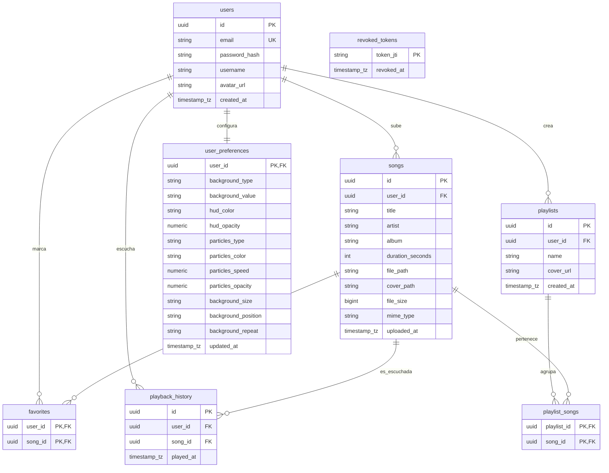

# Modelo Entidad-Relación y Normalización de la Base de Datos

**Proyecto:** Rin'ne — Plataforma de Streaming de Música Personal  
**Entregable:** Diseño del Modelo Relacional Ampliado y Proceso de Normalización  
**Versión:** 2.0  

---

## 1. Introducción

Para soportar el alcance robusto y las características interactivas de **Rin'ne**, se diseñó una base de datos relacional basada en **PostgreSQL 15**. El diseño garantiza:
*   Integridad referencial y transaccional total (propiedades ACID).
*   Eliminación de redundancias mediante normalización formal.
*   Capacidad de almacenar configuraciones de HUD dinámicas por usuario, metadatos multimedia enriquecidos, listas de reproducción flexibles e historiales de reproducción.

---

## 2. Definición Detallada de Entidades (Esquema de 8 Entidades)

El modelo consta de **8 entidades estructuradas**, superando el diseño inicial simplificado para dar soporte formal al alcance completo del proyecto:

### 1. `users` (USUARIO)
Representa las cuentas de usuario registradas en la plataforma.
*   `id` (UUID, Primary Key): Identificador único de usuario generado de forma segura mediante `gen_random_uuid()`.
*   `email` (VARCHAR(255), Unique, Not Null): Correo electrónico del usuario, sirve como credencial de acceso.
*   `password_hash` (VARCHAR(255), Not Null): Contraseña del usuario cifrada de forma segura con `bcrypt`.
*   `username` (VARCHAR(100)): Nombre de visualización del perfil de usuario.
*   `avatar_url` (VARCHAR(500)): URL o ruta física a la imagen de perfil del usuario.
*   `created_at` (TIMESTAMPTZ, Default NOW()): Fecha y hora de creación de la cuenta.

### 2. `songs` (CANCION)
Metadatos de los archivos de audio subidos por los usuarios.
*   `id` (UUID, Primary Key): Identificador único de la canción.
*   `user_id` (UUID, Foreign Key): Referencia al usuario propietario de la canción (`users.id`). Si el usuario se elimina, la canción se borra en cascada (`ON DELETE CASCADE`).
*   `title` (VARCHAR(255), Not Null): Título de la pista de audio (extraído de los metadatos ID3 o nombre de archivo).
*   `artist` (VARCHAR(255), Default 'Artista Desconocido'): Nombre del intérprete o banda.
*   `album` (VARCHAR(255), Default 'Álbum Desconocido'): Nombre del álbum al que pertenece la canción.
*   `duration_seconds` (INTEGER, Not Null): Duración exacta de la canción en segundos.
*   `file_path` (VARCHAR(500), Not Null): Ruta de almacenamiento local (EC2) o clave del objeto en AWS S3.
*   `cover_path` (VARCHAR(500)): Ruta física o URL de la carátula o portada personalizada del archivo.
*   `file_size` (BIGINT, Not Null): Tamaño del archivo de audio en bytes.
*   `mime_type` (VARCHAR(100), Not Null): Tipo MIME de compresión (ej. `audio/mpeg`, `audio/flac`).
*   `uploaded_at` (TIMESTAMPTZ, Default NOW()): Fecha de subida de la canción.

### 3. `playlists` (PLAYLIST)
Cabeceras de las listas de reproducción de los usuarios.
*   `id` (UUID, Primary Key): Identificador único de la lista de reproducción.
*   `user_id` (UUID, Foreign Key): Referencia al usuario creador de la lista (`users.id`). Con eliminación en cascada.
*   `name` (VARCHAR(100), Not Null): Nombre de la lista de reproducción.
*   `cover_url` (VARCHAR(500)): Imagen representativa de la lista de reproducción.
*   `created_at` (TIMESTAMPTZ, Default NOW()): Fecha de creación.

### 4. `playlist_songs` (PLAYLIST_SONG - Relación Muchos a Muchos)
Tabla intermedia que rompe la relación de muchos a muchos entre canciones y listas de reproducción.
*   `playlist_id` (UUID, Primary Key, Foreign Key): Referencia a la lista de reproducción (`playlists.id`). Con eliminación en cascada.
*   `song_id` (UUID, Primary Key, Foreign Key): Referencia a la canción añadida (`songs.id`). Con eliminación en cascada.

### 5. `favorites` (FAVORITO - Relación Muchos a Muchos)
Relación intermedia de canciones marcadas como "Favoritas" por los usuarios.
*   `user_id` (UUID, Primary Key, Foreign Key): Referencia al usuario (`users.id`).
*   `song_id` (UUID, Primary Key, Foreign Key): Referencia a la canción (`songs.id`).

### 6. `user_preferences` (PREFERENCIA)
Detalle completo de la configuración visual del HUD y fondo de pantalla persistido por usuario.
*   `user_id` (UUID, Primary Key, Foreign Key): Referencia 1:1 al usuario (`users.id`). Con eliminación en cascada.
*   `background_type` (VARCHAR(50), Default 'solid'): Tipo de fondo (`solid`, `image`).
*   `background_value` (VARCHAR(255), Default '#131315'): Color hexadecimal o URL de la imagen de fondo.
*   `hud_color` (VARCHAR(7), Default '#00dbe9'): Color hexadecimal del acento de la interfaz HUD.
*   `hud_opacity` (NUMERIC(3,2), Default 0.80): Opacidad visual del HUD (rango 0.00 a 1.00).
*   `particles_type` (VARCHAR(50), Default 'none'): Tipo de animación de partículas (`none`, `snow`, `dots`, `lines`).
*   `particles_color` (VARCHAR(50), Default 'white'): Color de las partículas flotantes.
*   `particles_speed` (NUMERIC(3,2), Default 1.00): Velocidad de animación de las partículas.
*   `particles_opacity` (NUMERIC(3,2), Default 0.50): Opacidad de las partículas.
*   `background_size` (VARCHAR(50), Default 'cover'): Propiedad CSS de escala de fondo.
*   `background_position` (VARCHAR(50), Default 'center'): Posicionamiento CSS del fondo.
*   `background_repeat` (VARCHAR(50), Default 'no-repeat'): Repetición de la imagen de fondo.
*   `updated_at` (TIMESTAMPTZ, Default NOW()): Fecha del último cambio estético realizado.

### 7. `playback_history` (HISTORIAL_REPRODUCCION)
Registro secuencial para rastrear la actividad e historial de canciones escuchadas.
*   `id` (UUID, Primary Key): Identificador de la transacción de escucha.
*   `user_id` (UUID, Foreign Key): Referencia al usuario que escuchó la canción (`users.id`).
*   `song_id` (UUID, Foreign Key): Referencia a la canción reproducida (`songs.id`).
*   `played_at` (TIMESTAMPTZ, Default NOW()): Marca de tiempo exacta de reproducción.

### 8. `revoked_tokens` (TOKEN_REVOCADO)
Lista negra para invalidación de JSON Web Tokens (JWT) al cerrar sesión de forma stateless.
*   `token_jti` (VARCHAR(255), Primary Key): Identificador único del JWT (`jti` payload).
*   `revoked_at` (TIMESTAMPTZ, Default NOW()): Fecha en que se revocó el token.

---

## 3. Diagrama Entidad-Relación en Mermaid (Notación Patas de Gallo)

El siguiente diagrama modela visualmente de forma interactiva y con alta fidelidad las 8 entidades, sus atributos clave y las cardinalidades de las relaciones:

---

## 4. Proceso Formal de Normalización de la Base de Datos

Para garantizar la estabilidad, evitar redundancias, anomalías de inserción, actualización y borrado, el diseño de la base de datos de Rin'ne se sometió a un proceso riguroso de normalización, satisfaciendo la **Tercera Forma Normal (3FN)**:

### A. Primera Forma Normal (1FN)
*   **Condición:** Todos los atributos de las relaciones deben ser atómicos (no contener grupos repetitivos, campos multivalorados ni compuestos) y existir una Llave Primaria (PK) definida.
*   **Solución en Rin'ne:** 
    *   Cada campo en cada tabla almacena un único valor atómico (por ejemplo, el correo electrónico es una cadena indivisible y no una lista de correos; el color de HUD y tipo de fondo están separados en columnas independientes en lugar de un campo de texto compuesto de configuraciones).
    *   Todas las tablas tienen llaves primarias explícitas basadas en UUID (identificadores únicos universales) o llaves primarias compuestas en tablas intermedias (`playlist_id` + `song_id`).
    *   **Cumple con la 1FN.**

### B. Segunda Forma Normal (2FN)
*   **Condición:** Debe cumplir la 1FN y todos los atributos no primos (no pertenecientes a la llave primaria) deben tener dependencia funcional total sobre toda la llave primaria. No pueden existir dependencias parciales sobre partes de una llave compuesta.
*   **Solución en Rin'ne:**
    *   Las tablas `users`, `songs`, `playlists`, `user_preferences`, `playback_history` y `revoked_tokens` poseen llaves primarias simples de un solo atributo (UUID o string `token_jti`). Por definición matemática, en llaves primarias simples no pueden existir dependencias funcionales parciales (no hay subconjuntos de la clave principal de los cuales dependan campos).
    *   Para las tablas con llaves compuestas, como `playlist_songs` (`playlist_id`, `song_id`) y `favorites` (`user_id`, `song_id`), no existen atributos no primos. Ambas son tablas puramente de asociación Muchos a Muchos, compuestas únicamente por llaves foráneas. Al no haber campos descriptores externos adicionales parciales, no existe violación de la 2FN.
    *   **Cumple con la 2FN.**

### C. Tercera Forma Normal (3FN)
*   **Condición:** Debe cumplir la 2FN y no deben existir dependencias funcionales transitivas entre atributos no primos. Es decir, ningún atributo que no sea llave puede depender de otro atributo no llave; todos los atributos no primos deben depender única y directamente de la Llave Primaria.
*   **Solución en Rin'ne:**
    *   En la entidad `songs`, atributos como `title`, `artist`, `duration_seconds` y `file_path` dependen directamente y por completo de la llave primaria `id` de la canción, y no del `user_id` ni de otra columna no clave.
    *   En la entidad `user_preferences`, todos los parámetros de personalización visual (colores, velocidad de partículas, fondos) describen estrictamente las preferencias del `user_id` (PK) y dependen directamente de esta llave de forma directa. No hay relaciones lógicas del tipo "si la opacidad del HUD es X, entonces el tipo de partículas es Y".
    *   En `playlists`, el `name` y `cover_url` describen a la lista de reproducción y dependen únicamente del identificador de la playlist.
    *   **Cumple con la 3FN.**
